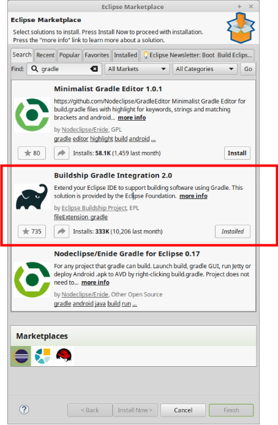

[](https://travis-ci.org/andifalk/spring-basics-training)


# Spring Basics Training
Spring basics training is a basic Spring Framework and Spring Boot training. 
In this course, students build a Spring Java application including the Spring Core Framework and related modules like Spring Boot, Spring MVC, Spring Data, Spring Security and Spring Testing with lots of hands-on labs.

Depending on the intensity of diving into the spring world this training is targeted
as a 1-day or 2-days training workshop.

## Presentation

["Spring Basics Training" Presentation (html)](https://andifalk.github.io/spring-basics-training/presentation/index.html)

## Labs (Hands-On)

### System Requirements

* A Java SDK (version 8 or higher)
* Gradle build system
* Any Java IDE (Eclipse, IntelliJ, VS Code, NetBeans)

### Setup

All labs contain _initial_ and _complete_ directories.
In _init_ directory you find all required source code to start and complete the lab. In _complete_ directory 
you find the complete solution of the lab.

As we are building the samples using [Gradle](https://gradle.org) your Java IDE should be capable use this.

As IntelliJ user support for Gradle is included by default.
As an Eclipse user you have to install a plugin via the marketplace



To get the workshop project you either can just clone the repository using

```
https://github.com/andifalk/spring-basics-training.git
```

or

```
 git@github.com:andifalk/spring-basics-training.git
```

or simply download it as a [zip archive](https://github.com/andifalk/spring-basics-training/archive/master.zip).

After that you can import the workshop project into your IDE

* IntelliJ: "New project from existing sources..."
* Eclipse: "Import/Gradle/Existing gradle project"

### Table of Contents

1. Core Spring Labs
    1. [Beans and Application Context (XML)](https://github.com/andifalk/spring-basics-training/tree/master/lab-1)
    2. [Beans and Application Context (Java Annotations, Component Scanning)](https://github.com/andifalk/spring-basics-training/tree/master/lab-2) 
    3. [Lifecycle of Spring Beans](https://github.com/andifalk/spring-basics-training/tree/master/lab-3)	
    4. [Aspect Oriented Programming (Just some basics)](https://github.com/andifalk/spring-basics-training/tree/master/lab-4)
    5. [Advanced Bean Wiring (Qualifier, Profile)](https://github.com/andifalk/spring-basics-training/tree/master/lab-5)
    6. [Spring Expression Language (SpEL)](https://github.com/andifalk/spring-basics-training/tree/master/lab-6)
2. Spring Boot Labs
    1. [Create a new App using 'start.spring.io'](https://github.com/andifalk/spring-basics-training/tree/master/lab-7)
    2. [Externalized Configuration (Property and YAML)](https://github.com/andifalk/spring-basics-training/tree/master/lab-8)
    3. [DevOps: Logging and Monitoring (Actuator)](https://github.com/andifalk/spring-basics-training/tree/master/lab-9)
3. Spring Data Labs
    1. [Spring Data JPA](https://github.com/andifalk/spring-basics-training/tree/master/lab-10)
    2. [Flyway Database Migrations](https://github.com/andifalk/spring-basics-training/tree/master/lab-11)
4. Spring MVC Labs
    1. [RESTful Services](https://github.com/andifalk/spring-basics-training/tree/master/lab-12)
5. Spring Security Labs
    1. [Authentication and Authorization](https://github.com/andifalk/spring-basics-training/tree/master/lab-13)
6. Testing Labs
    1. [Unit and Integration Tests (Test slices)](https://github.com/andifalk/spring-basics-training/tree/master/lab-14)
    2. Security Tests (*Upcoming*)
7. Reactive Spring (*Upcoming*)
    1. Reactive Streams with Project Reactor
    2. Reactive Persistence (MongoDB)
    3. WebFlux: Annotated Controller
    4. WebFlux: Router/Handler      

## License

Apache 2.0 licensed

Copyright (c) by 2018 Andreas Falk
