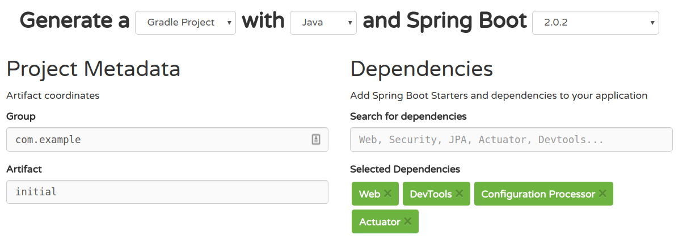

# Lab 7: Create a new Spring Boot App
In this lab we start using Spring Boot and generate an initial new application using [start.spring.io](https://start.spring.io)
or the corresponding spring initialzr wizards in your IDE.

After completing this lab you should know how to create a full stack application with spring boot in just some minutes.
This basic application already includes production ready monitoring features with the spring boot actuator.

## Initial code

There is no _initial_ project this time as we will now create this in next steps. 

In the _complete_ project you find the generated spring boot project with following classes/files:

* CompleteApplication: This is the generated starter class to start the spring boot application (contains a main() method).
Please note: When you have generated your application following the steps below you will get same start class but with name *InitialApplication*
* DemoRestController: A sample spring controller defining a simple REST interface.
* application.properties: This is the generated default application configuration properties file
* CompleteApplicationTests: A sample spring integration test just verifying a successful start of the spring application
 
## Steps to complete

1. Browse to [start.spring.io](https://start.spring.io) or open the corresponding wizard in your IDE. 

2. Select the following entries:
    
    * Gradle Project
    * Java
    * Spring Boot `2.0.2` or newer
    * Group = `com.example`
    * Artifact = `initial`
    * Dependencies = `Web`, `DevTools`, `Configuration Processor` and `Actuator`

    
    
3. Generate the project (if you did NOT use an IDE wizard 
you have to unzip the downloaded file and import the extracted contents into your IDE)   

4. Open the *build.gradle* file. Here you will notice some new entries.

    Two new gradle plugins have been added:

    *  org.springframework.boot: This plugin packages the spring boot app into an executable jar or war file
    *  io.spring.dependency-management: This plugin adds automatic version management for dependencies
    
    Also new dependencies have been added:
    
    ``` 
      compile('org.springframework.boot:spring-boot-starter-actuator')
      compile('org.springframework.boot:spring-boot-starter-web')
      runtime('org.springframework.boot:spring-boot-devtools')
      compileOnly('org.springframework.boot:spring-boot-configuration-processor')
      testCompile('org.springframework.boot:spring-boot-starter-test')
    ``` 

5. Add a new class *DemoRestController* with following code to the *com.example* package:

    ``` 
        @RestController
        public class DemoRestController {
            
            @GetMapping("/")
            public String hello() {
                return "Hello Spring Boot";
            }
        }
    ``` 

6. Start the application using *InitialApplication* class. 
After some seconds you have your first running application. This application does not do pretty much for now.
Browse to [localhost:8080](http://localhost:8080) then you should see `Hello Spring Boot` on the screen. 

7. Now you are ready to start over with this first spring boot application. 
We will continue to work on this application in next labs and add more and more functionality to this. 

***Tip:***
If you need any help then consult the [presentation](https://andifalk.github.io/spring-basics-training/presentation/index.html) 
or the [Spring Boot Reference Docs](https://docs.spring.io/spring-boot/docs/current/reference/htmlsingle/#getting-started-first-application). 
If you are really have no clue you can always look into the finished reference code in _complete_ sub project

